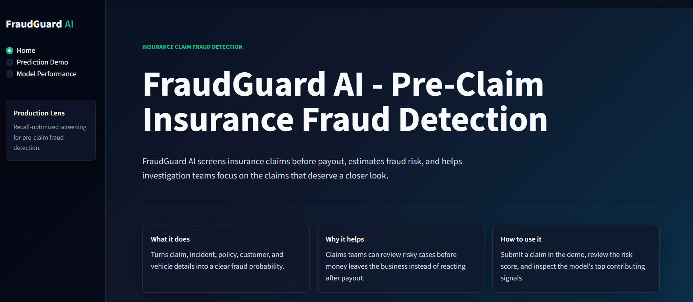
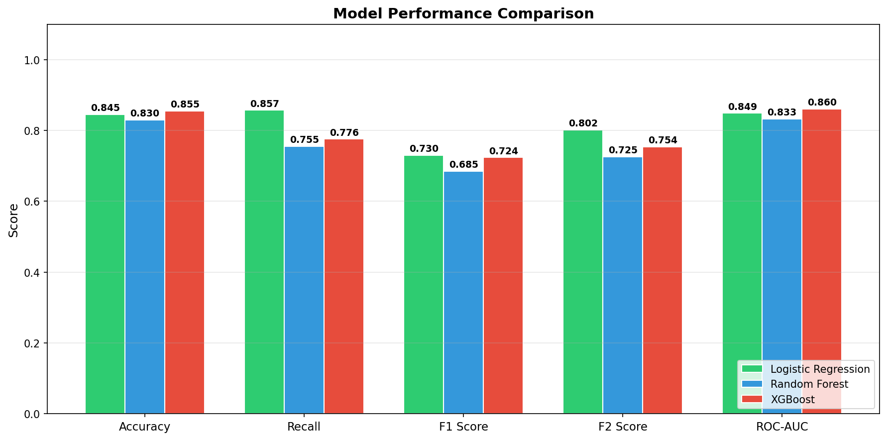
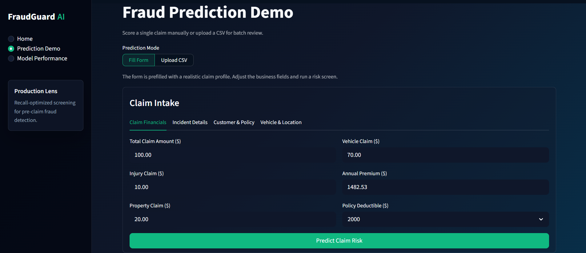

# FraudGuard AI — Insurance Claim Fraud Detection System

[](https://python.org)
[](https://streamlit.io)
[](https://scikit-learn.org)
[](LICENSE)

🔗 **[Live Demo → fraudguard-ai.streamlit.app](https://fraudguard-ai.streamlit.app)**

FraudGuard AI is a Machine Learning-powered insurance claim fraud detection system designed to identify suspicious automobile insurance claims and support fraud investigation workflows.

The project combines:

* Machine Learning
* Business-rule intelligence
* Interactive analytics dashboards
* Risk scoring and reporting

---

# Application Preview



---

# Problem Statement

Insurance fraud causes significant financial losses for insurance companies every year. Fraudulent claims may include:

* fake accidents
* exaggerated injury claims
* inflated repair costs
* staged collisions
* false theft reports

Manually reviewing every claim is expensive and time-consuming.

FraudGuard AI helps identify high-risk claims early, prioritize investigations, and improve fraud screening efficiency.

---

# Insurance Domain

This project focuses on:

```text
Automobile Insurance Claim Fraud Detection
```

The dataset contains automobile accident and insurance claim records including:

* customer information
* policy details
* accident details
* claim financials
* vehicle information
* fraud labels

Target Variable:

```text
Fraudulent Claim vs Legitimate Claim
```

---

#  Features Used

### Claim Financial Features

* total_claim_amount
* injury_claim
* vehicle_claim
* property_claim
* policy_annual_premium
* policy_deductable

### Incident Features

* incident_type
* collision_type
* incident_severity
* incident_hour_of_the_day
* number_of_vehicles_involved
* bodily_injuries
* witnesses
* police_report_available
* property_damage

### Customer & Policy Features

* age
* months_as_customer
* insured_occupation
* insured_education_level
* insured_relationship
* policy_state

### Vehicle & Location Features

* auto_make
* auto_model
* auto_year
* incident_state
* incident_city

---

# Feature Engineering

Additional engineered features were created to improve fraud detection performance:

* claim_ratio
* incident_year
* vehicle_age
* days_between_policy_incident
* csl_per_person
* csl_per_accident

These engineered features help capture suspicious claim behavior and fraud-related patterns.

---

# Model Performance

The final model selected for this project is **Logistic Regression**.

Although multiple models were tested, including **Random Forest** and **XGBoost**, Logistic Regression was chosen as the best production-ready model because it achieved the strongest balance for fraud detection, especially on **recall**.

| Model | Accuracy | Recall | F1 Score | F2 Score | ROC-AUC |
| --- | --- | --- | --- | --- | --- |
| **Logistic Regression** ✓ | 0.845 | **0.857** | **0.730** | **0.802** | 0.849 |
| Random Forest | 0.830 | 0.755 | 0.685 | 0.726 | 0.833 |
| XGBoost (SMOTE, tuned) | 0.855 | 0.776 | 0.724 | 0.754 | 0.860 |
| XGBoost (scale_pos_weight, tuned) | 0.845 | **0.857** | **0.730** | **0.802** | 0.841 |

> XGBoost was additionally evaluated with `scale_pos_weight` class balancing and full RandomizedSearchCV tuning (50 iterations, 6 hyperparameters). The best XGBoost configuration achieved **identical recall and F2 to Logistic Regression**, confirming that the simpler model is the correct production choice — equal performance with better interpretability and faster inference.

## Why Logistic Regression Was Selected

In insurance fraud detection, **missing a fraudulent claim is more costly than sending a legitimate claim for review**. Because of this, the model was selected primarily based on **Recall** and **F2 Score**, not accuracy alone.

While the original unbalanced XGBoost missed more fraud cases, retraining XGBoost with class weight balancing (`scale_pos_weight`) and hyperparameter tuning allowed it to match the highest recall (86%) and F2 score (0.802) of Logistic Regression.

However, **Logistic Regression was still selected as the final production model** because it delivers identical recall and F2 score to the tuned XGBoost while being:

- **Highly interpretable:** Easier to explain prediction logic and feature contributions to claims adjusters, investigators, and regulators.
- **Simpler and faster:** Faster to train, run, and maintain in production with zero deployment overhead compared to complex tree ensembles.

The final model is not intended to automatically reject claims. Instead, it acts as a **fraud risk screening tool** that helps prioritize claims for manual or SIU review.

### Model Performance Visuals



---

## Explainability & Risk Interpretation

FraudGuard AI uses **SHAP (SHapley Additive exPlanations)** via `shap.LinearExplainer` 
to generate per-prediction, instance-level explanations.

Each prediction shows which features pushed the fraud probability up or down 
for that specific claim — not global model weights, but claim-specific reasoning.

SHAP analysis revealed that `incident_severity_major_damage` is the strongest 
global fraud signal. Features like insured hobbies appearing in top SHAP values 
are acknowledged as likely spurious correlations from the small dataset (~1000 rows) 
rather than genuine causal fraud indicators.

Explanations support fraud-risk interpretation workflows but should not be treated 
as legal or causal proof of fraud.

---

# Hybrid Fraud Detection Logic

FraudGuard AI combines:

1. Machine Learning probability scoring
2. Additional business-rule fraud analysis (post-model business-rule adjustment)

Example business-rule signals:

* unusually high injury claims
* missing police reports
* inconsistent claim breakdowns
* suspicious timing patterns
* inflated claim-to-premium ratios

This improves fraud-screening realism and operational interpretability.

---

# Application Features

* Multi-page Streamlit dashboard
* Fraud probability scoring
* Risk classification
* Explainable AI outputs
* Visual risk drivers
* Downloadable HTML investigation reports

### Prediction Demo



---

# Tech Stack

- **Programming & Data Processing**: Python,Pandas,NumPy

- **Machine Learning**: Scikit-learn, Imbalanced-learn / SMOTE, Logistic Regression, Random Forest, XGBoost, Joblib for model serialization

- **Data Visualization**: Plotly, Matplotlib, Seaborn

- **Web Application**: Streamlit, Custom CSS

- **Model Explainability & Reporting**: SHAP (LinearExplainer), per-prediction waterfall contributions, business-rule fraud signals, HTML and PDF investigation report generation

---

### Deployment

* Streamlit Community Cloud

---

# 📁 Project Structure

```text
FraudGuard-AI/
│
├── app.py
├── app_pages/
├── src/
├── models/
├── data/
├── assets/
├── notebooks/
├── tests/           (pytest suite for data pipeline and model validation)
├── requirements.txt
└── README.md
```

---

# System Flow
 
```text
Raw Insurance Claim
        │
        ▼
Feature Engineering
(claim_ratio, vehicle_age, days_between_policy_incident, csl splits)
        │
        ▼
Logistic Regression Pipeline
(StandardScaler + OneHotEncoder + SMOTE + LR)
        │
        ▼
Base Fraud Probability Score
        │
        ▼
Business Rule Adjustment
(injury-to-damage ratio, missing police report, short tenure, claim dominance)
        │
        ▼
Final Risk Score + Signals
        │
        ├── Low  (<35%)  → Auto-approve
        ├── Medium (35–65%) → Manual review
        └── High  (>65%)  → Escalate to SIU
```
 
---

# Limitations

FraudGuard AI is a fraud-screening support tool, not a final fraud decision system.

- The predictions are based on probabilities, so the model may sometimes predict fraud incorrectly or miss some fraud cases.
- The dataset is limited in size and scope. Real-world insurance fraud systems require significantly larger and more diverse datasets.
- Human investigation is still required for final fraud decisions.
- The deployed model prioritizes explainability and recall over maximum predictive performance.
- Some business-rule checks added in the app are manually designed and may not fully represent real insurance company workflows.
- Model performance is based on historical labeled data and may not perform well on completely new or evolving fraud patterns.
- Some input fields are simplified or internally generated for demo purposes.
- The model can produce false positives and false negatives.
- Feature contribution explanations only show which factors influenced the prediction. They should not be treated as legal proof of fraud.
- The app does not include production monitoring, drift detection, or real-time claim system integration.

FraudGuard AI should be viewed as a fraud risk assessment and investigation support tool rather than a fully automated fraud detection system.

---

# Future Improvements

- FastAPI backend for real-time claim scoring API
- Ensemble learning models (stacking LR + XGBoost)
- Real-time API integration with claims management systems
- User authentication and role-based access
- Claim history tracking and trend analysis
- Production-grade monitoring and model drift detection
- Larger, more diverse training dataset to reduce spurious correlations

---

# What I Learned

* Built an end-to-end ML pipeline with SMOTE inside an imbalanced-learn `Pipeline` to prevent data leakage during cross-validation
* Used `make_scorer(fbeta_score, beta=2)` as the `RandomizedSearchCV` scoring function so hyperparameter search optimized directly for fraud recall, not accuracy
* Designed business-rule post-processing on top of model probability scores to capture fraud signals that statistical features alone cannot express
* Implemented coefficient-based feature contribution explanations for logistic regression as a lightweight, production-compatible alternative to SHAP
* Learned why precision-recall tradeoffs matter more than accuracy in imbalanced, high-cost classification problems like insurance fraud

---

# Conclusion

FraudGuard AI demonstrates how Machine Learning and business-rule intelligence can work together to support insurance fraud investigation workflows.

The project focuses not only on prediction accuracy, but also on:

* explainability
* fraud reasoning
* business value
* investigation support

making it closer to a realistic fraud analytics application rather than a simple ML notebook project.
